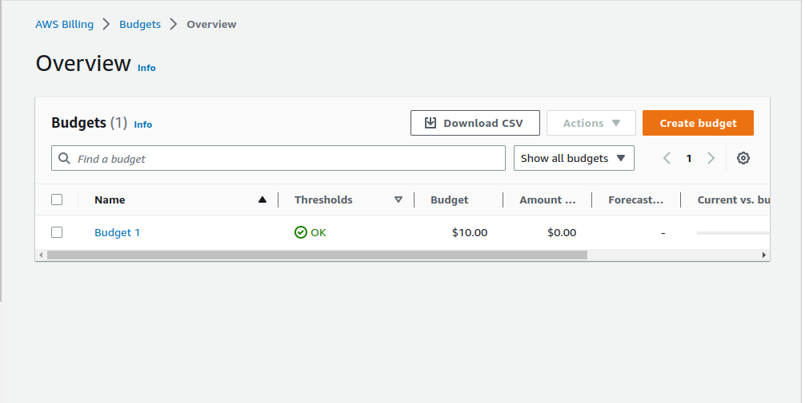

# Week 0 — Billing and Architecture

- Learnt about what is to be considered when coming up with a good archetucture diagram for a product to be developed.
- Configured Gitpod and AWS CLI on my local machine and while using Gitpod.


- Updated gitpod.yml file to enable automatic install of AWS for everytime I start the workspace.

- Created an AWS budget with AWS CLI (Added the AWS folder that has the budget.json file)

- Had some challenges creating a budget via Gitpod so I used the terminal of my local machine. Created an AWS folder on my local machine, created the budget and notification.json files. Then ran:

```
aws budgets create-budget \
    --account-id my_account_id \
    --budget file://budget.json \
    --notifications-with-subscribers file://notifications-with-subscribers.json

```



- Recreated the [Cruddurr logical & Conceptual diagrams](https://lucid.app/lucidchart/d8b7fa99-1188-4248-87ba-6c2afefc871a/edit?invitationId=inv_0742fca2-32b8-4d5d-84ff-775e43e73494).


### To store AWS credentials permanently, I used

        gp env AWS_ACCESS_KEY_ID="Insert Here"
        gp env AWS_ACCESS_KEY_ID="Insert Here"
        gp env AWS_DEFAULT_REGION="Insert Here"
